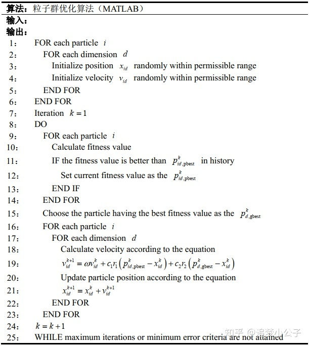
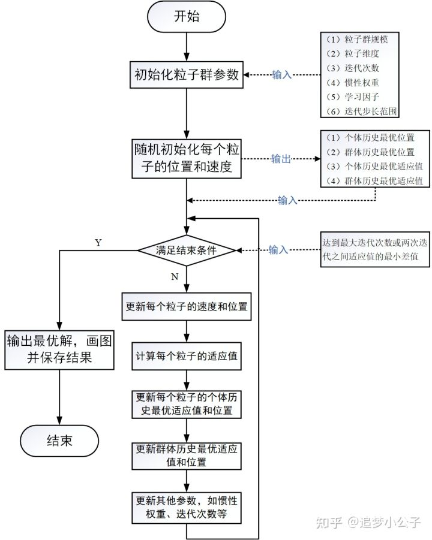

[Rosenbrock函数 - 维基百科，自由的百科全书 (wikipedia.org)](https://zh.wikipedia.org/zh-cn/Rosenbrock函數)

# Rosenbrock函数

也称为**Rosenbrock山谷**或**Rosenbrock香蕉函数**，也简称为**香蕉函数**。
$$
f(x,y) = {(1 - x)^2} + 100{(y - {x^2})^2}.\quad 
$$
​		Rosenbrock函数的每个[等高线](https://zh.wikipedia.org/wiki/等高线)大致呈[抛物线](https://zh.wikipedia.org/wiki/抛物线)形，其全域最小值也位在抛物线形的山谷中（香蕉型山谷）。很容易找到这个山谷，但由于山谷内的值变化不大，要找到全域的最小值相当困难。

​		其全域最小值位于$(x,y)=(1,1)$点，数值为$f(x,y)=0$.有时第二项的系数不同，但不会影响全域最小值的位置。

## 多变量下的扩展

​		多变量的Rosenbrock函数有以下二种形式。一种是$N/2$个独立二维Rosenbrock函数的和：
$$
f({\mathbf{x}}) = f({x_1},{x_2}, \ldots ,{x_N}) = \sum\limits_{i = 1}^{N/2} {\left[ {100{{(x_{2i - 1}^2 - {x_{2i}})}^2} + {{({x_{2i - 1}} - 1)}^2}} \right]} .
$$
​		此形式只在$N$为偶数时有定义，而且其解较简单。

另一个较复杂的形式为：
$$
f({\mathbf{x}}) = \sum\limits_{i = 1}^{N - 1} {\left[ {{{(1 - {x_i})}^2} + 100{{({x_{i + 1}} - x_i^2)}^2}} \right]} \quad \forall {\mathbf{x}} \in {\mathbb{R}^N}.
$$
​		可证明当$N=3$时，此形式的Rosenbrock函数只有一个最小值（位置在(1,1,1)），在 $4\leqslant N \leqslant 7$时只有二个最小值，所有变量均为1时有全局最小值，而在$({x_1},{x_2}, \ldots ,{x_N}) = ( - 1,1, \ldots ,1)$附近有局部最小值。此结果是将令函数的梯度为0后求得，Rosenbrock函数的梯度仍为一个$x$的多项式，在$N$较小时，可以精确的列出多项式，再求出实根的个数，而其根限制在$|{x_i}| < 2.4$的范围内。若$N$较大时因为相关的系数太多，无法用以上方式进行。

## 随机函数

​		有许多方式可以将Rosenbrock函数延伸到随机（stochastic）函数，以下是一种例子：
$$
f({\mathbf{x}}) = \sum\limits_{i = 1}^{n - 1} [ {(1 - {x_i})^2} + 100{\varepsilon _i}{({x_{i + 1}} - x_i^2)^2}]
$$
​		其中随机变量${\varepsilon _i}(i = 1,2,...,n - 1)$服从[均匀分布](https://zh.wikipedia.org/wiki/連續型均勻分布) $Unif(0,1)$。原则上，此随机函数的全局最小值仍在$(1,1,...,1)$，不过因为其随机的特性，任何以[梯度下降法](https://zh.wikipedia.org/wiki/梯度下降法)为基础的优化算法均无法用来求得此随机函数的最小值。

## 可适用的优化算法

​		经若经过适当的坐标系调整，可以在没有梯度信息及不创建局部近似模型的情形下（和其他不使用梯度信息的优化算法相反），用优化算法求得Rosenbrock函数的最小值。以下的例子说明如何用[适应坐标下降法](https://zh.wikipedia.org/w/index.php?title=適應坐標下降法&action=edit&redlink=1)对二维的Rosenbrock函数进行优化，启始点$x_0=(-3,-4)$。在325次函数的运算后可找到最小值的位置，函数的数值为$10^{-10}$。

## 相关条目

* [Himmelblau函数](https://zh.wikipedia.org/w/index.php?title=Himmelblau函數&action=edit&redlink=1)
* [Rastrigin函数](https://zh.wikipedia.org/w/index.php?title=Rastrigin函數&action=edit&redlink=1)
* [格里旺克函数](https://zh.wikipedia.org/wiki/格里旺克函数)

# 粒子群算法

[粒子群优化算法(Particle Swarm Optimization, PSO)的详细解读 - 知乎 (zhihu.com)](https://zhuanlan.zhihu.com/p/346355572)

