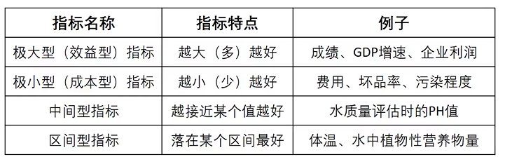
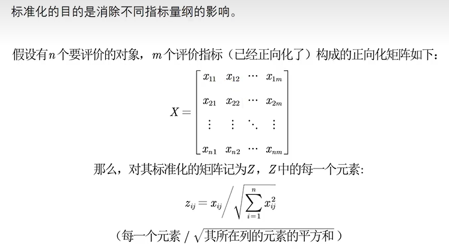
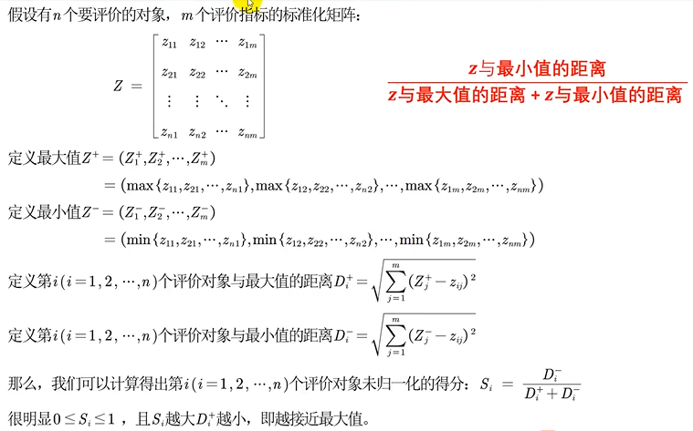

### 步骤

#### 1. 将原始矩阵正向化

##### 最常见的四种指标



​		将原式矩阵正向化，就是要将所有的指标类型统一转化为极大型指标。(PS：转换的函数形式可以不唯一)

###### 极小型指标$ \to $极大型指标

$$
极小型指标转换为极大型指标的公式:\\
max-x\\
如果所有的元素均为正数，那么也可以使用\frac{1}{x}
$$

###### 中间型指标$ \to $极大型指标

​		**中间型指标**：指标值既不要太大也不要太小，取某特定值最好(如水质量评估PH值)
$$
\{x_i\}是一组中间型指标序列，且最佳的数值为x_{best},那么正向化的公式如下:\\
M=\max\{|x_i-x_{best}|\},{\tilde x_i}=1-\frac{{{{|x_i - x_{best} |}}}}{M}
$$

| PH值（转换前） |                     PH值（转化后）                     |
| :------------: | :----------------------------------------------------: |
|       6        | $1 - \frac{{\left| {6 - 7} \right|}}{2} = \frac{1}{2}$ |
|       7        |      $1 - \frac{{\left| {7 - 7} \right|}}{2} = 1$      |
|       8        | $1 - \frac{{\left| {8 - 7} \right|}}{2} = \frac{1}{2}$ |
|       9        |      $1 - \frac{{\left| {9 - 7} \right|}}{2} =0$       |

$x_{best}=7$		$M=\max\{|6-7|,|7-7|,|8-7|,|9-7|\}$

###### 区间型指标$ \to $极大型指标

​		**区间型指标**:指标值落在某个区间内最好，例如人的体温在36℃ ~ 37℃这个区间比较好。
$$
\{x_i\}是一组中间型指标序列，且最佳的区间为[a,b],那么正向化的公式如下:\\
M=\max\{a-\max\{x_i\},\max\{x_i\}-b\},{\tilde x_i}=\left\{
\begin{matrix}
1-\frac{{{{a - x}}}}{M},x<a\\
1,a \leq x \leq b\\
1-\frac{{{{x - b}}}}{M},x>b
\end{matrix}
\right.
$$

| 体温（转换前） | 体温（转化后） |
| :------------: | :------------: |
|      35.2      |     0.4286     |
|      35.8      |     0.8571     |
|      36.6      |       1        |
|      37.1      |     0.9286     |
|      37.8      |     0.4286     |
|      38.4      |       0        |

$a=36,b=37$		$M=\max\{36-35.2,38.4-37\}=1.4$

#### 2. 正向化矩阵标准化



#### 3. 计算得分并归一化



```
共有20个评价对象, 4个评价指标
这4个指标是否需要经过正向化处理，需要请输入1 ，不需要输入0：  1
请输入需要正向化处理的指标所在的列，例如第2、3、6三列需要处理，那么你需要输入[2,3,6]： [2,3,4]
请输入需要处理的这些列的指标类型（1：极小型， 2：中间型， 3：区间型） 
例如：第2列是极小型，第3列是区间型，第6列是中间型，就输入[1,3,2]：  [2,1,3]
第2列是中间型
请输入最佳的那一个值： 7
第2列中间型正向化处理完成
~~~~~~~~~~~~~~~~~~~~分界线~~~~~~~~~~~~~~~~~~~~
第3列是极小型，正在正向化
第3列极小型正向化处理完成
~~~~~~~~~~~~~~~~~~~~分界线~~~~~~~~~~~~~~~~~~~~
第4列是区间型
请输入区间的下界： 10
请输入区间的上界： 20
第4列区间型正向化处理完成
~~~~~~~~~~~~~~~~~~~~分界线~~~~~~~~~~~~~~~~~~~~
正向化后的矩阵 X =  
  列 1 至 3
    4.6900    0.7172    3.0000
    2.0300    0.4069   35.0000
    9.1100    0.5241    8.0000
    8.6100    0.9655    8.0000
    7.1300    0.6552    4.0000
    2.3900    0.8414   16.0000
    7.6900    0.8552   16.0000
    9.3000    0.8690   27.0000
    5.4500    0.5724   49.0000
    6.1900    0.8138   37.0000
    7.9300    0.6345   45.0000
    4.4000    0.8069   37.0000
    7.4600    0.1448   31.0000
    2.0100         0    7.0000
    2.0400    0.5862   31.0000
    7.7300    0.4069    2.0000
    6.3500    0.6000   29.0000
    8.2900    0.0276   15.0000
    3.5400    0.8138         0
    7.4400    0.4897   46.0000
  列 4
    1.0000
    0.6940
    0.9058
    0.4443
    0.6914
    0.6007
    0.6551
         0
    1.0000
    0.7848
    0.6992
    0.5419
    1.0000
    0.4546
    1.0000
    1.0000
    0.1824
    1.0000
    0.4088
    0.2731
标准化矩阵 Z = 
  列 1 至 3
    0.1622    0.2483    0.0245
    0.0702    0.1408    0.2863
    0.3150    0.1814    0.0655
    0.2977    0.3342    0.0655
    0.2466    0.2268    0.0327
    0.0826    0.2912    0.1309
    0.2659    0.2960    0.1309
    0.3216    0.3008    0.2209
    0.1885    0.1981    0.4009
    0.2141    0.2817    0.3027
    0.2742    0.2196    0.3682
    0.1522    0.2793    0.3027
    0.2580    0.0501    0.2536
    0.0695         0    0.0573
    0.0705    0.2029    0.2536
    0.2673    0.1408    0.0164
    0.2196    0.2077    0.2373
    0.2867    0.0095    0.1227
    0.1224    0.2817         0
    0.2573    0.1695    0.3763
  列 4
    0.3065
    0.2127
    0.2776
    0.1361
    0.2119
    0.1841
    0.2008
         0
    0.3065
    0.2405
    0.2143
    0.1661
    0.3065
    0.1393
    0.3065
    0.3065
    0.0559
    0.3065
    0.1253
    0.0837
请输入是否需要增加权重向量，需要输入1，不需要输入0
请输入是否需要增加权重： 1
使用熵权法确定权重请输入1，否则输入0： 1
熵权法确定的权重为：
  列 1 至 3
    0.1411    0.2267    0.4409
  列 4
    0.1913
最后的得分为：
stand_S =
    0.0390
    0.0552
    0.0411
    0.0428
    0.0362
    0.0441
    0.0489
    0.0525
    0.0750
    0.0716
    0.0755
    0.0653
    0.0543
    0.0181
    0.0578
    0.0360
    0.0506
    0.0399
    0.0317
    0.0643
sorted_S =
    0.0755
    0.0750
    0.0716
    0.0653
    0.0643
    0.0578
    0.0552
    0.0543
    0.0525
    0.0506
    0.0489
    0.0441
    0.0428
    0.0411
    0.0399
    0.0390
    0.0362
    0.0360
    0.0317
    0.0181
index =
    11
     9
    10
    12
    20
    15
     2
    13
     8
    17
     7
     6
     4
     3
    18
     1
     5
    16
    19
    14
>> 
```

