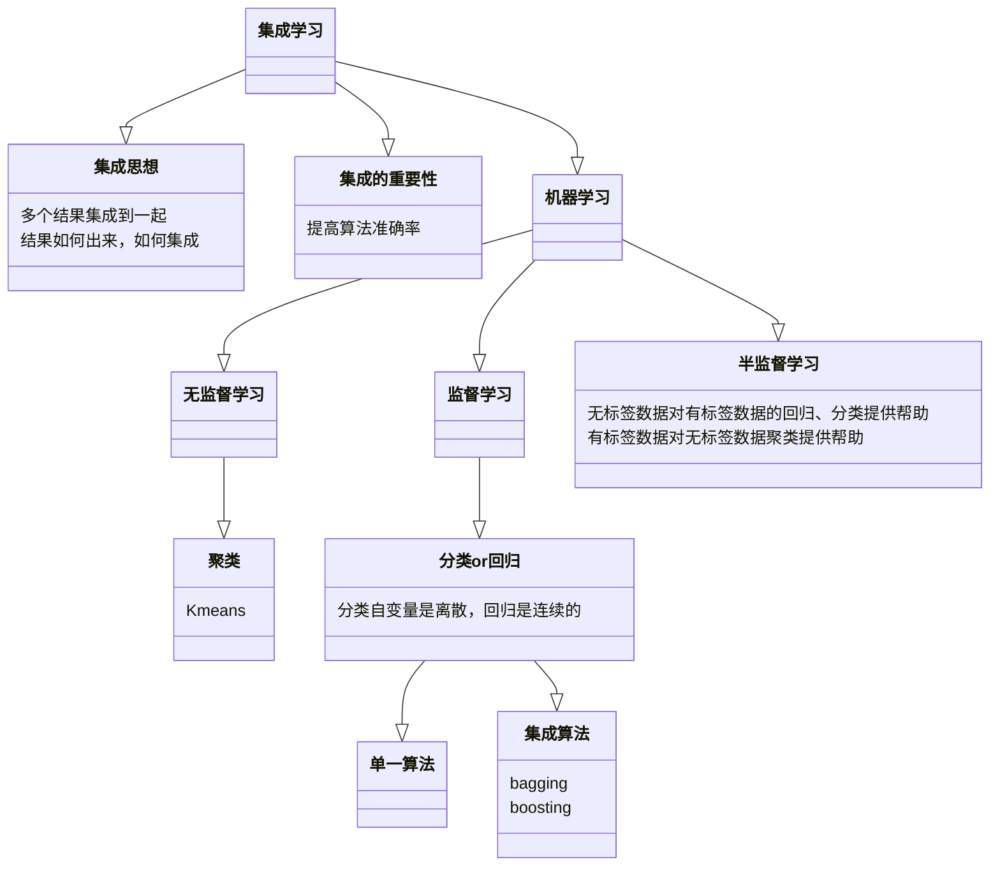
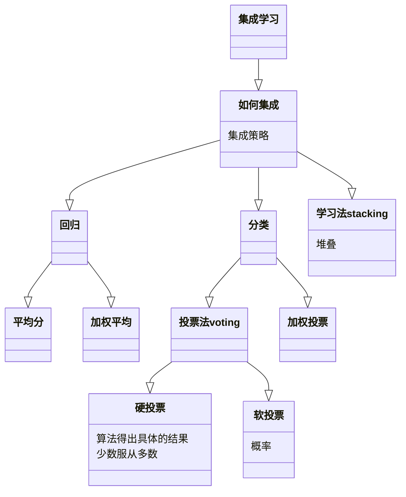
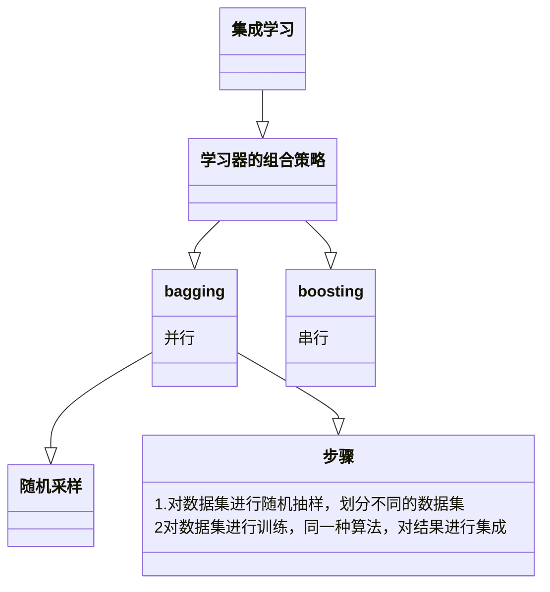

# 1-28培训学习笔记

[TOC]

## 博弈论

        静态博弈 or 动态博弈

### 可用的参考书

> 数学建模第5版.pdf
> `https://www.aliyundrive.com/s/prFBR8VWuFD` 
> 提取码: 4c8k
> 
> 备注：第十章

### 画横线法

        最终都选择坦白，这个纳什均衡


### 转移图法

        考虑两个国家(国家A和B)在军备竞赛中陷入僵局。我们从国家A开始考虑，它可以保持军备或者裁军。结果依赖于国家B是否裁军。我们把结果用4，3，2，1排序，其中4表示最好的结果而1表示最坏的结果。


### 存在多个纳什均衡的博弈


 

        画横线发解决不了这个问题


### 一些方法

- 几何法

- 代数法

- 最大最小-最小最大方法

- 转移图

- 2×2完全冲突博弈的其他简便解法
  
  1. 让对手的策略对应的期望值相等
  
  2. 零头法，也称为William方法

- 博弈树
  
  
  
  - 逆向归纳法剪枝得均衡

- 蜈蚣博弈

## 集成学习

### 数据集划分

1. 训练集

2. 测试集

3. 验证集

### K折交叉验证

> 分成K段，求准确率平均值

        对超参数进行优化

### 集成思想

        就是把多个结果集成到一起，关键：结合

#### 目的

        提高结果准确率








## LaTex

[LaTeX安装 & 宏包升级 - 知乎 (zhihu.com)](https://zhuanlan.zhihu.com/p/210303123)

[LaTeX详细教程+技巧总结_NSJim的博客-CSDN博客_latex教程](https://blog.csdn.net/NSJim/article/details/109066847?ops_request_misc=%257B%2522request%255Fid%2522%253A%2522167462879216800215018653%2522%252C%2522scm%2522%253A%252220140713.130102334..%2522%257D&request_id=167462879216800215018653&biz_id=0&utm_medium=distribute.pc_search_result.none-task-blog-2~all~top_positive~default-1-109066847-null-null.142%5ev71%5ejs_top,201%5ev4%5eadd_ask&utm_term=latex&spm=1018.2226.3001.4187)

[【LaTex】LaTex的下载与安装（超详细、超简洁）_latex下载_X.IO的博客-CSDN博客 ](https://blog.csdn.net/weixin_45954198/article/details/127430721?ops_request_misc=%257B%2522request%255Fid%2522%253A%2522167462879216800215018653%2522%252C%2522scm%2522%253A%252220140713.130102334..%2522%257D&request_id=167462879216800215018653&biz_id=0&utm_medium=distribute.pc_search_result.none-task-blog-2~all~top_positive~default-4-127430721-null-null.142%5ev71%5ejs_top,201%5ev4%5eadd_ask&utm_term=latex&spm=1018.2226.3001.4187)

### 下载

首先安装 [Texlive](https://mirrors.tuna.tsinghua.edu.cn/CTAN/systems/texlive/Images/texlive.iso)

1. 安装 [texstudio](https://github.com/texstudio-org/texstudio/releases)
   
   

        可点击直接下载，也可以借助 [GitHub Proxy 代理加速 (ghproxy.com)](https://ghproxy.com/) 加速下载，比直接点下载快，但是可能还比较慢。建议下载Latest稳定版。


### 一份简短的关于 LATEX 安装的介绍

        **首先要学会看文档**

#### 文档安装

```bash
tlmgr install install-latex-guide-zh-cn
```

#### 文档打开

```bash
texdoc install-latex-guide-zh-cn
```

#### 升级宏包


### 问题

1. 编译各种Beamer模板时出现报错`Loading 'expl3.sty' aborted!`
   
   解决方法：cmd窗口中输入`fmtutil-user --all`
   
   方法来源： `https://tex.stackexchange.com/questions/576918/mismatched-latex-support-files-detected`

2. `Emergency stop. \RequireXeTeX`
   
   解决方法：在首行设置用`% !TEX program = xelatex` 更换编译器

      也可以 ，注意编译器，别只知道看图操作！！！


### 模板下载


### 期刊模板下载


### 公式编辑

#### 在线编辑器

[在线LaTeX公式编辑器-编辑器 (latexlive.com)](https://www.latexlive.com/home##)

#### MathType

##### 下载

[MathType中文版下载_数学公式编辑器下载-MathType中文网](https://www.mathtype.cn/xiazai.html?cjtg=mathtype_newsbox_xiazai)

 [MathType_v7.x_Patch.exe](https://pan.baidu.com/s/1qUsMkaqQYLmIMwwz3RIehw?pwd=hb4z ) 

##### 安装

1. 打开`MathType-7.4.10.53.exe`文件，完成安装，安装之后不要打开MathType

2. 将 `MathType_v7.x_Patch.exe` 文件复制到MathType的已安装好的目录，然后打开该文件，完成破解。

> 注意：理论上这个破解文件适用于`MathType 7.x`的所有版本，所以当你更新完MathType失效后，重新走一遍破解步骤即可。

### 清除编译缓存文件

        将下面代码cv至`#delete-temp-files.txt`文件，再改为后缀为`.bat` 文件

```batch
@echo off
del /q *.aux *.bbl *.blg *.log *.out *.toc *.bcf *.xml *.synctex *.nlo *.nls *.bak *.ind *.idx *.ilg *.lof *.lot *.ent-x *.tmp *.ltx *.los *.lol *.loc *.listing *.gz *.userbak *.nav *.snm *.vrb *.synctex(busy)


del /q *.nav *.snm *.vrb *.fls *.xdv *.fdb_latexmk
```

        双击该文件便可以自动清除缓存

### 模板使用

[一个模板](https://pan.baidu.com/s/1tcO6ZTPe1K2Kzx5WwQUg1w?pwd=rjpt)

        可以参考里面的注释

> 注意：`pdflatex`编译器不能出现中文，可能比较适合美赛(不能有中文的)书写，存在中文便报错

```latex
% !TEX program = pdflatex
```

        设置编译器，自选，美赛建议`pdflatex`，注意这个出现中文便报错


